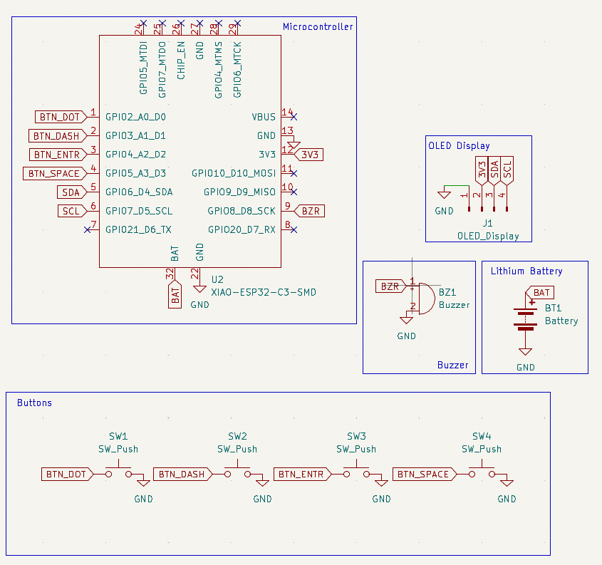
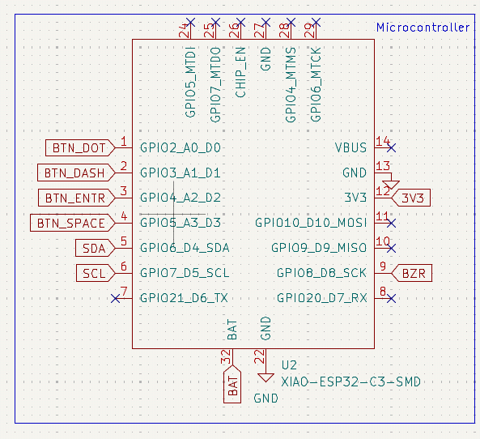
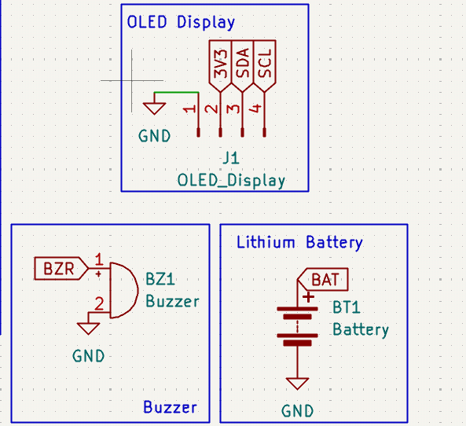
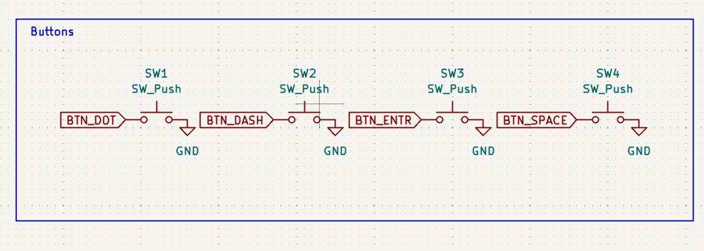
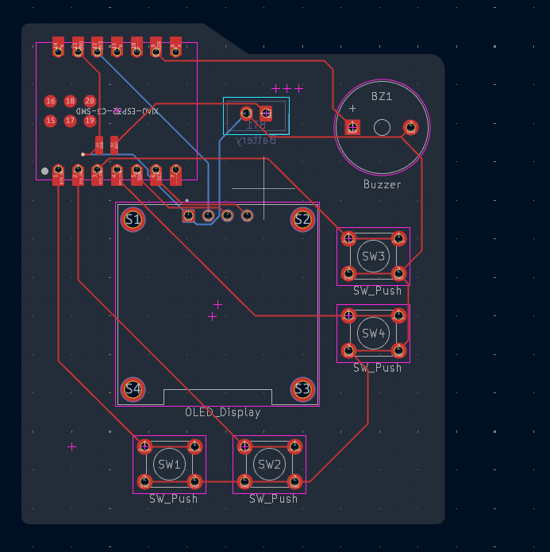
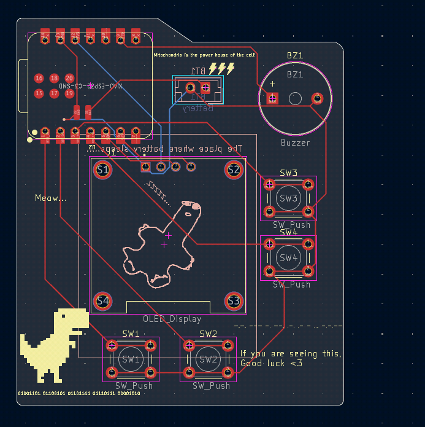

---

title: "Morsed"
author: "Lavish (@HighInSummer)"
description: "A Morse Code learning PCB!"
created_at: "2026-04-27"
total_time: "~6.5 hours"

---

# Session-1: Resources (30th April)

In this session, I finalised my idea and components which I will use.  
This included the Microcontroller - XIAO-ESP32C3, the 0.96'' OLED and powering and battery sources.  

For reference i used: https://wiki.seeedstudio.com/XIAO_ESP32C3_Getting_Started/

Datasheet: [Datasheet PDF](https://files.seeedstudio.com/wiki/XIAO_WiFi/Resources/esp32-c3_datasheet.pdf)

I also needed to navigate to find appropriate Symbols and Footprint, which took a while.

Lapse: https://lapse.hackclub.com/timelapse/Dv903yFhxwQe

**Time: 20 minutes**

# Session-2 Schematic (30th April)

Next up I designed the schematic from the symbols I took from the internet.  
It had a XIAO-ESP32-C3 *DIP* symbol (I changed this later), a 4 pin Connector for OLED display, 4 switches, battery and other stuff.
./Images/

The schmeatic was easy to make, and didn't take much time too.  

So after I completed the schematic, I assigned footprints to the components. While finding the Footprint for the XIAO, I realised I could just use the SMD model.
Previously I was using the DIP model, but later switched it to SMD one, because it has the BAT and GND external power input too, which I needed.
So I assigned the footprints, changed the model and updated schematic (can be reviewed in the Lapse rec.)

Lapse:  
https://lapse.hackclub.com/timelapse/sImAvIpWE0f1  
https://lapse.hackclub.com/timelapse/FlrShXgA0tuo 
https://lapse.hackclub.com/timelapse/CZHjHYN6qG-l

**Time: 3 hours**

# Session-3: PCB (1st May)

After updating and completing the schematic, I moved on to PCB.  
Layered all the components as I wanted on it.

For the battery, I am using a small 3.7V lithium battery, which will be connected to a JST connector, which is connected to XIAO's BAT power connection.  
This was the easiest and convinient option, so yeah! I'm up for suggestions!

After layering, I drew the Edge Cut outer layer.

Lastly, the main part, the traces. It was pretty straightforward since we have few and simple components.

Later I designed the board with some artwork and stuff!

### The 3D view!:

Once again up for changes and suggestions!

Lapse:  
https://lapse.hackclub.com/timelapse/7fYodb_MaFgr  
https://lapse.hackclub.com/timelapse/EBsMB1VnyEKW

**Time**: 2 hours

### Previous Version Idea

So this is the second version of the Morse PCB we can say. The previous version was with a PCB with a single button only and just flashing LEDs representing letters!  
Then I realised it would be much more easier and practical in a sense to put a display than to put 26 different LEDs and some LED drivers with them, etc.  
ANd yeah this was really better.

So I almost completed the whole schematic and spent a whole hour lol; these are the Lapse recs of them:  
https://lapse.hackclub.com/timelapse/Njg4GARlFPXW
https://lapse.hackclub.com/timelapse/7STQQVc3jdY_

#### Note: Firmware to come! Shipping this, and might re-ship with the firmware!

### All Lapse Recordings in Order

1. [Previous Version](https://lapse.hackclub.com/timelapse/Njg4GARlFPXW)
2. [Previous Version](https://lapse.hackclub.com/timelapse/7STQQVc3jdY_)
3. [Resource and stuff](https://lapse.hackclub.com/timelapse/Dv903yFhxwQe)
4. [Schematic](https://lapse.hackclub.com/timelapse/sImAvIpWE0f1)
5. [Schematic completion and Footprints](https://lapse.hackclub.com/timelapse/FlrShXgA0tuo)
6. [Some changes in Schematic and Footprints](https://lapse.hackclub.com/timelapse/CZHjHYN6qG-l)
7. [PCB](https://lapse.hackclub.com/timelapse/7fYodb_MaFgr)
8. [PCB completion](https://lapse.hackclub.com/timelapse/EBsMB1VnyEKW)
  - [Extras](https://lapse.hackclub.com/timelapse/5lH0LEIWmey5)
  - [Extras](https://lapse.hackclub.com/timelapse/m7NEmCFYdTBv) 

